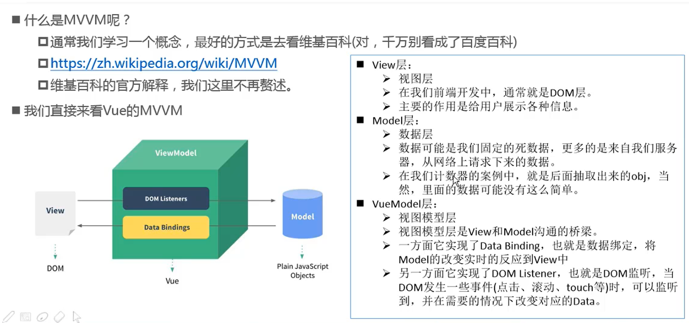

# Vue

## Vue 初体验

```html
<div id="app">{{name}}</div>
<!-- 在浏览器中就会显示Hello Vue -->
```

```js
const app = new Vue({
  //声明式编程
  el: '#app', //用于挂载要管理的元素
  data: {
    name: 'Hello Vue'//定义数据
  }
})
```

可以通过修改 app._data.name 来修改data里面的name值

列表

```html
<div id="app">
    <ul>
      <li v-for="item in numbers">{{item}}</li>
    </ul>
  </div>
```

```js
const app = new Vue({
  //声明式编程
  el: '#app', //用于挂载要管理的元素
  data: {
    numbers: ['1', '2', '3', '4'],
  }
})
```

v-for也可以获得里面的索引值

```html
<h2 v-for="(item, index) in lists"></h2>
```

```html
<div id="app">
    <p>当前的数字为:{{counter}}</p>
    <button @click="inc">+</button>
    <button @click="sub">-</button>
</div>
```

```js
const app = new Vue({
  el: '#app',
  data: {
    counter: 0
  },
  methods: {
    inc () {
      this.counter++;
      console.log('数字增长');
    },
    sub () {
      this.counter--;
      console.log('数字减小');
    }
  }
});
```

注意： ```@click='sub'``` 和 ```v-on:click='sub'``` ```@clilck``` 是 ```v-on:click``` 的语法糖

## Vue 中的mvvm原理

MVVM： Model View ViewModel



## Vue 的生命周期


## 插值的操作

### Mustache语法

双大括号的语法就是 Mustache(英文：胡须) 语法

mustache是不能写在属性里面的即 不能      ```
    <h2>{{name}}</h2>
    <h2 v-once>{{name}}</h2>
</div>
<!-- 上面的是111，下面展示的是 我是一个名字 -->
```

```javascript
const app = new Vue({
  el: '#app',
  data: {
    name: '我是一个名字'
  }
});

app.name = '111';
```

h2\[v-once\]展示的永远是最初显示的那个值

### v-html 指令

v-html能够将字符串解析成html

```html
<div id="app">
    <h2 v-html="url"></h2>
</div>
```

```javascript
const app = new Vue({
  el: '#app',
  data: {
    url: `<a href='https://www.baidu.com'>百度一下</a>`
  }
});
```

### v-text

v-text 和 {{}} 相同，但是v-text会覆盖原来的文本

```html
<div id="app">
    <h2 v-text='name'>这里的文本会被替换掉</h2>
</div>
```

```js
const app = new Vue({
  el: '#app',
  data: {
    name: 'ddd'
  }
});
```

### v-pre

和pre标签一样

### v-cloak

cloak是斗篷的意思，为了防止网络较慢时，将{{name}}解析出来，我们用v-cloak

当vue执行完毕后，会自动将v-cloak删除掉

```html
<div id="app" v-cloak>
    <h2>{{name}}</h2>
</div>
```

```javascript
setTimeout(() => {
  const app = new Vue({
    el: '#app',
    data: {
      name: 'ddd'
    }
  });
},2000)
```

```css
[v-cloak] {
    display: none;
}
```

## v-bind 动态绑定属性

```html
<div id="app">
      
</div>
```

```javascript
const app = new Vue({
  el: '#app',
  data: {
    imgSrc: 'https://cn.vuejs.org/images/logo.png'
  }
})
```

添加了 ```v-bind``` 后，src后面的值就是一个变量了

我们也可以写成

```html
<div id="app">
      
</div>
```

```v-bind:``` 的语法糖 ```:```

### v-bind动态绑定```class```类名


#### 用对象的方式


语法：

```html
<div v-bind:class="{类名1 : Boolean, 类名2 : Boolean ………… }"></div>
```

当后面的值为true的时候，类名就会被添加到class里面，否则不会

```html
<div id="app">
      <h2 :class="{active: isActive, line: isLine}">这里是内容</h2>
<!--这里就会看到黑底白字-->
</div>
```

```javascript
const app = new Vue({
  el: '#app',
  data: {
    isActive: true,
    isLine : true
  }
})
```

```css
.active {
    color: #fff;
}

.line {
    background-color: #000;
}
```

注意： ```v-bind:class``` 和 ```class``` 可以同时存在，他们不会覆盖，最后是两个内容的合并


小案例: 点击按钮文字颜色的切换

```html
<div id="app">
      <h2 :class="{active: isActive}">这里是内容</h2>
      <button @click="changeActive">变色</button>
</div>
```

```javascript
const app = new Vue({
  el: '#app',
  data: {
    isActive: true
  },
  methods: {
    changeActive () {
      this.isActive = !this.isActive;
    }
  }
})
```

```css
.active {
    color: #f40;
}
```

#### 用数组的方式

```html
<div id="app">
      <h2 :class="[varClass1, varClass2]">这里是内容</h2>
  </div>
```

```javascript
const app = new Vue({
  el: '#app',
  data: {
    varClass1 : 'active',
    varClass2 : 'line'
  }
})
```

作业：点击列表，使得点击的变红，未点击的变黑

```html
<div id="app">
      <ul>
          <li v-bind:class="{active: isActive[index]}" v-for="(number, index) in numbers" @click="changeColor(index)">{{number}}</li>
      </ul>
</div>
```

```css
.active {
    color: #f40;
}
```

```javascript
const app = new Vue({
  el: '#app',
  data: {
    numbers : [111, 222, 333, 444, 555],
    isActive: [1,0,0,0,0]
  },
  methods: {
    changeColor(index) {
      this.isActive = [0,0,0,0,0];
      this.isActive[index] = 1;
    }
  }
})
```

### v-bind动态绑定style

- 对象语法
- 数组语法

#### 对象语法

语法;

```html
<h2 :style="{css属性名： css属性值，………………}"></h2>
```

```html
<div id="app">
      <h2 :style="{fontSize: `${fontSize}px`}">这里是内容</h2>
</div>
```

```javascript
const app = new Vue({
  el: '#app',
  data: {
    fontSize: 50
  }
})
```

#### 数组语法

```html
<div id="app">
      <h2 :style="[{fontSize: '50px'}, {color: 'red'}]">这里是内容</h2>
</div>
```

## 计算属性的使用

### 基础使用

computed 是计算属性，里面仍然写的是方法，但是在HTML的mustache语法中不需要加小括号

```html
<div id="app">
      <h2 v-once>{{fullName}}</h2>
</div>
```

```javascript
const app = new Vue({
  el: '#app',
  data: {
    firstName : 'Bob',
    lastName : 'Jim'
  },
  //computed 是计算属性，里面仍然写的是方法，但是在HTML的mustache语法中不需要加小括号
  computed : {
    fullName () {
      return `${this.firstName} ${this.lastName}`
    }
  }
})
```

这里是稍复杂的使用

```html
<div id="app">
        <h2 v-once>总价格：{{allPrice}}</h2>
</div>
```

```javascript
const app = new Vue({
  el: '#app',
  data: {
    books: [
      {id: 2, price: 121},
      {id: 1, price: 119},
      {id: 3, price: 110}
    ]
  },
  computed: {
    allPrice() {
      let price = 0;
      for(let book of this.books){
        price += book['price'];
      }
      return price;
    }
  }
})

console.log(app);
```

#### 这里补充一下 for-of 和 for-in 的区别

对于下面的代码

```javascript
let arr = ['a', 'b', 'c'];
for(let index in arr){
    console.log(index);//输出字符串类型的 0 1 2
    //这里的index不是arr中的元素，而是字符串类型的索引
}
```

```javascript
let arr = ['a', 'b', 'c'];
for(let el of arr) {
    console.log(el);
    //这里输出的才是arr中的元素
}
```

- for-in 是ES5标准， for-of 是ES6标准

### 计算属性的 setter 和 getter 方法

计算属性的完整写法是具有 set 和 get 方法的，但是一般情况下我们是不写setter的，我们经常写成函数的形式

get 返回的值是计算属性的值，而我们对计算属性赋的值，会以参数的形式传入到set方法中

```html
<div id="app">
        <h2 v-once>{{fullName}}</h2>
</div>
```

```javascript
const app = new Vue({
  el: '#app',
  data: {
    firstName: 'Jim',
    lastName: 'Bob'
  },
  computed: {
    fullName: {
      set(newVal) {
        console.log(newVal);
      },
      get() {
        return `${this.firstName} ${this.lastName}`;
      }
    }
  }
})

app.fullName = '11111';
//这里会输出11111，但是不会改变页面上的文字
```

### computed 和 methods 的区别

computed 是会被Vue内部缓存起来的，不会被频繁调用。当内容发生改变时，Vue会重新调用computed里面的方法

## v-on 事件监听

### 参数传递

- 如果该方法不需要额外的参数，那么方法后面的 ```()``` 可以不添加；

但是要注意，方本身有一个参数，默认的将原生的event参数传递进去

```html
<div id="app">
        <h2 v-on="buttonClick('aaa')"></h2>
</div>
```

```javascript
const app = new Vue({
  el: '#app',
  methods: {
    buttonClick (txt) {
      console.log(txt);
    }
  }
})
```

在js中的函数写上一个形参，而在html中不加小括号，浏览器会自动传入事件对象

```html
<div id="app">
        <button @click="click"></button>
</div>
```

```javascript
const app = new Vue({
  el: '#app',
  methods: {
    click(event) {
      console.log(event);//输出事件对象
    }
  }
})
```

但是如果html中加了小括号，那么就会输出 ```undefind```

```html
<div id="app">
        <button @click="click()"></button>
 </div>
```

```javascript
const app = new Vue({
  el: '#app',
  methods: {
    click(txt, event) {
      console.log(txt);
      console.log(event);//输出undefined
    }
  }
})
```

当有多个形参，但是在HTML中没有加小括号，那么默认的将event对象传递给第一个参数

- 当我们既要使用event对象，又要使用其他的参数时：通过 ```$event```获取浏览器的event对象

```html
<div id="app">
        <button @click="click('111',$event)"></button>
</div>
```

```javascript
const app = new Vue({
  el: '#app',
  methods: {
    click(event,abc) {
      console.log(event);
      console.log(abc);//这里输出事件对象，不是上面那个event形参，因为$event写在了后面
    }
  }
})
```

### v-on修饰符

- stop : 阻止事件冒泡

```html
<div id="app">
        <div @click="divClick">
            <p>这里是段落</p>
            <button @click.stop="btnClick">按钮</button>
        </div>
</div>
```

```js
const app = new Vue({
  el: '#app',
    methods: {
      btnClick() {
          console.log('btnClick');
      },
      divClick() {
          console.log('divClick');
      }
    }
})
```

- prevent 阻止默认事件

例：阻止表单的提交

```html
<div id="app">
        <form action="https://www.baidu.com/">
            <label>
                这里是啥
                <input type="text" name="name">
                <input type="submit" value="submit" @click.prevent>
            </label>
        </form>
</div>
```

阻止链接的跳转

```html
<div id="app">
        <a href="https://www.baidu.com" @click.prevent>百度</a>
</div>
```

- once 只触发一次回调函数

```html
<div id="app">
        <label>
            <input @keyup.once="btnClick($event)">
        </label>
</div>
```

## v-if 和 v-else 的使用

### v-if语法：

```html
<div v-if="布尔值"></div>
当布尔值为true时，显示该元素，为false时不显示该元素
```

```html
<div id="app">
        <h2 v-if="true">显示该元素</h2>
        <h2 v-if="false">不显示该元素</h2>
</div>
```

### v-else v-else-if

邮箱和用户名登录切换的小案例

```html
<div id="app">
        <label v-if="isUserName">
            用户名 <br>
            <input type="text" placeholder="用户名" >
        </label>
        <label v-else>
            邮箱 <br>
            <input type="text" placeholder="邮箱">
        </label>
        <button @click="changeLogin">按钮</button>
</div>
```

```javascript
const vue = new Vue({
  el: '#app',
  data: {
    isUserName: 1
  },
  methods: {
    changeLogin() {
      this.isUserName = !this.isUserName;
    }
  }
})
```

但是有一个小问题，在输入框有文字的时候，我们点击切换按钮的时候，里面的内容不会被清空

这是因为Vue会复用一些相同的代码来提高性能，这里的label 和 input 就被复用了

如果不想复用，那么给他们不同的key值

```html
<div id="app">
        <label v-if="isUserName">
            用户名 <br>
            <input type="text" placeholder="用户名" key="username">
        </label>
        <label v-else>
            邮箱 <br>
            <input type="text" placeholder="邮箱" key="email" >
        </label>
        <button @click="changeLogin">按钮</button>
</div>
```

### v-show 和 v-if 的区别

- 当 ```v-show``` 为 ```false``` 时， 仅仅是 ```display:none```
- 当 ```v-if``` 为 ```false``` 时， 这个元素会从DOM中移除

```html
<div id="app">
        <h2 v-if="false">v-if=false</h2>
        <h2 v-show="false">v-show=false</h2>
</div>
```

## v-for 的使用

### v-for 遍历数组

```html
<div id="app">
        <ul>
            <li v-for="(number, index) in numbers">{{index+1}}. {{number}}</li>
        </ul>
</div>
```

```javascript
const vue = new Vue({
  el:'#app',
  data: {
    numbers: [1, 2, 3, 4]
  }
})
```

### v-for 遍历对象

如果只传一个值，那么获取到的是 ```value```

```javascript
const vue = new Vue({
  el:'#app',
  data: {
    info: {
      name: 'zzz',
      age: 5,
      height: 130
    }
  }
})
```

```html
<ul>
   <li v-for="item in info">{{item}}</li>
</ul>
```

- 遍历key 和 value 

```html
<ul>
    <li v-for="(value, key) in info">{{key}}-{{value}}</li>
    <!--一定要注意，前面的是value-->
 </ul>
```

- 遍历 key value 和 index

```html
<ul>
    <li v-for="(value, key, index) in info">{{index}}-{{key}}-{{value}}</li>
</ul>
```

### v-for 添加key属性来复用


让 key 和每一项一一对应

但是下面这种方法不适用于数组中有相同的元素，因为key值是不能重复的

```html
    <div id="app">
        <ul>
            <li v-for="letter in letters" :key="letter">{{letter}}</li>
        </ul>
    </div>
```

```javascript
const vue = new Vue({
  el: '#app',
  data: {
    letters:['a', 'b', 'c', 'd', 'e']
  }
})

vue.letters.splice(2, 0, 'f');
```

注意：数组通过索引值更改的是不能被动态渲染到页面上的

```html
<div id="app">
        <ul>
            <li v-for="letter in letters" :key="letter">{{letter}}</li>
        </ul>
</div>
```

```javascript
const vue = new Vue({
  el: '#app',
  data: {
    letters:['a', 'b', 'c', 'd', 'e']
  }
})

vue.letters[1] = 'aaa';
//这里的aaa不会被渲染到页面上
```

## 过滤器

Vue.js 允许你自定义过滤器，可被用于一些常见的文本格式化。过滤器可以用在两个地方：双花括号插值和 v-bind 表达式

```html
<div id="app">
        <h2>价格：{{price | priceHandler}}</h2>
</div>
```

```javascript
const vue = new Vue({
  el: '#app',
  data: {
    price: 30
  },
  filters: {
    //这里面也是函数
    priceHandler(price) {
      //toFixed是保留几位小数
      return `${price.toFixed(2)}`
    }
  }
})
```

## 表单绑定 v-model

### 先来看三个数组的方法

- filter

filter 传入一个回调函数，每次将数组的一项传进去，当返回值为true时，将这一项传入新的数组中，若为false，则不进去

```javascript
const arr = ['a', 'b', 'c'];
const newArr = arr.filter((item) => {
  if(item === 'b'){
    return true;
  }else{
    return false;
  }
})
console.log(newArr);//输出 ['b']
```

- reduce 

对数组中所有的内容进行汇总

reduce传入两个参数，第一个是回调函数，这个回调函数，第一个是previous，第二个是数组的每一项

reduce的第二个参数是previous 的初始值，然后每一次回调函数的返回值会传递给previous

例：数组求和

```javascript
const arr = [1,2,3,4];
const sum = arr.reduce((previousValue, currentValue) => {
  return previousValue += currentValue
},0)

console.log(sum);//10
```

### v-model 双向绑定

表单中的数据更改，会改变app变量中的data中的值

```html
<div id="app">
        <label>
            <input type="text" v-model="content">
            {{content}}
        </label>
</div>
```

```javascript
const vue = new Vue({
  el: '#app',
  data: {
    content: '这是表单'
  }
})
```

v-model 也可以用于 textarea 元素

#### v-model原理

```html
<div id="app">
        <label>
            <input type="text" :value="content" @input="content = $event.target.value" >
        </label>
        <h2>{{content}}</h2>
</div>
```

```javascript
const vue = new Vue({
  el: '#app',
  data: {
    content: '这是表单'
  }
})
```

### v-model 的使用演示

#### v-model 和 radio (单选框) 的使用

单选框需要有相同的 ```name``` 值， 否则就都可以选上

但是，如果他们要相同的v-model值的时候，可以没有name 值

```html
<div id="app">
        <label for="male">
            <input type="radio" id="male" value="male" v-model="sex">男
        </label>
        <label for="female">
            <input type="radio" id="female" value="female" v-model="sex">女
        </label>
        <h2>{{sex}}</h2>
</div>
```

```javascript
const vue = new Vue({
  el: '#app',
  data: {
    sex: ''
  }
})
```

#### v-model 和 checkbox 的结合使用

```html
<div id="app">
        <label for="agree">
            <input type="checkbox" id="agree" value="true" v-model="isAgree">同意协议
        </label>
        <button v-bind:disabled="!isAgree">下一步</button>
</div>
```

```javascript
const vue = new Vue({
  el: '#app',
  data: {
    isAgree: false
  }
})
```

多个选项则保存在数组中

```html
<div id="app">
        <label>
            <input type="checkbox" value="basketball" v-model="hobbies">basketball
        </label>
        <label>
            <input type="checkbox" value="ping-pong" v-model="hobbies">ping-pong
        </label>
        <label>
            <input type="checkbox" value="baseball" v-model="hobbies">baseball
        </label>
        <h4>{{hobbies}}</h4>
</div>
```

```javascript
let vue;
vue = new Vue({
    el: '#app',
    data: {
        hobbies: []
    }
})
```

####  v-model 和 select

选择一个值的时候

```html
<div id="app">
        <label>
            <select v-model="fruit">
                <option value="apple">apple</option>
                <option value="banana">banana</option>
                <option value="grapes">grapes</option>
                <option value="orange">orange</option>
            </select>
        </label>
        <h3>{{fruit}}</h3>
</div>
```

```javascript
let vue;
vue = new Vue({
    el:'#app',
    data:{
        fruit:''
    }
})
```

当选择多个值的时候

```html
<div id="app">
        <label>
            <select v-model="fruits" multiple>
            <!--按住ctrl键选择多个-->
                <option value="apple">apple</option>
                <option value="banana">banana</option>
                <option value="grapes">grapes</option>
                <option value="orange">orange</option>
            </select>
        </label>
        <h3>{{fruits}}</h3>
</div>
```

```javascript
let vue;
vue = new Vue({
    el:'#app',
    data:{
        fruits:''
    }
})
```

#### 值绑定

```html
<div id="app">
        <label>
            <select v-model="selectedFruits" multiple>
                <option v-for="item in originFruits" :value="item">{{item}}</option>
            </select>
        </label>
        <h3>{{selectedFruits}}</h3>
</div>
```

```javascript
let vue = new Vue({
    el: '#app',
    data: {
        originFruits: ['apple', 'banana', 'orange', 'grape'],
        selectedFruits: []
    }
})
```

### v-model 修饰符

- lazy

为了减少改变的频率，我们用 ```lazy```

当表单失去焦点或者用户敲击回车的时候才盖章改变data里面的值

- number

默认情况下 v-model 绑定的是 字符串

```html
<div id="app">
        <label>
            <input type="number" v-model="content">
        </label>
        <h3>{{content}} : {{typeof content}}</h3>
<!--        这里只有一开始的0是number类型，后面改变的值都是string-->
</div>
```

```javascript
let vue = new Vue({
    el: '#app',
    data: {
       content: 0
    }
})
```

当 我们用了number修饰符， 那么data里面数据的类型就可以是number类型

```html
<div id="app">
        <label>
            <input type="number" v-model.lazy.number="content">
<!--这里可以写两个及以上的修饰符-->
        </label>
        <h3>{{content}} : {{typeof content}}</h3>
</div>
```

- trim

取出字符串两边的空白字符

```html
<div id="app">
    名字：<input type="text" v-model.trim="content">
</div>
```
