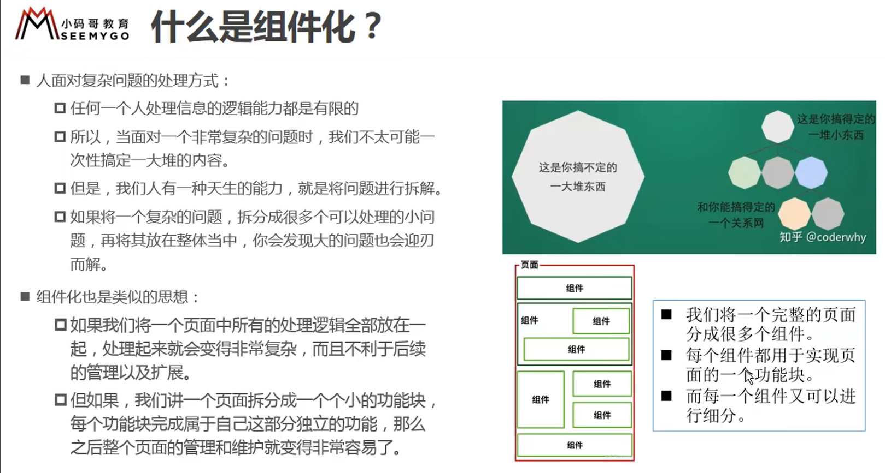
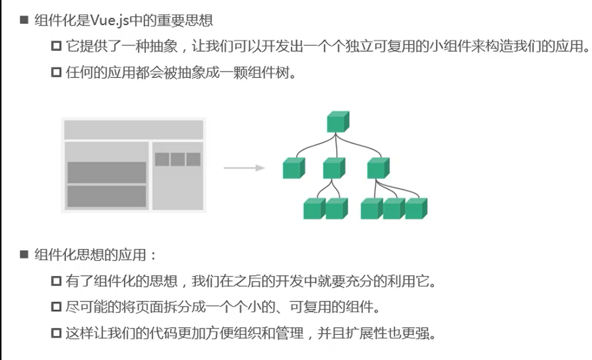
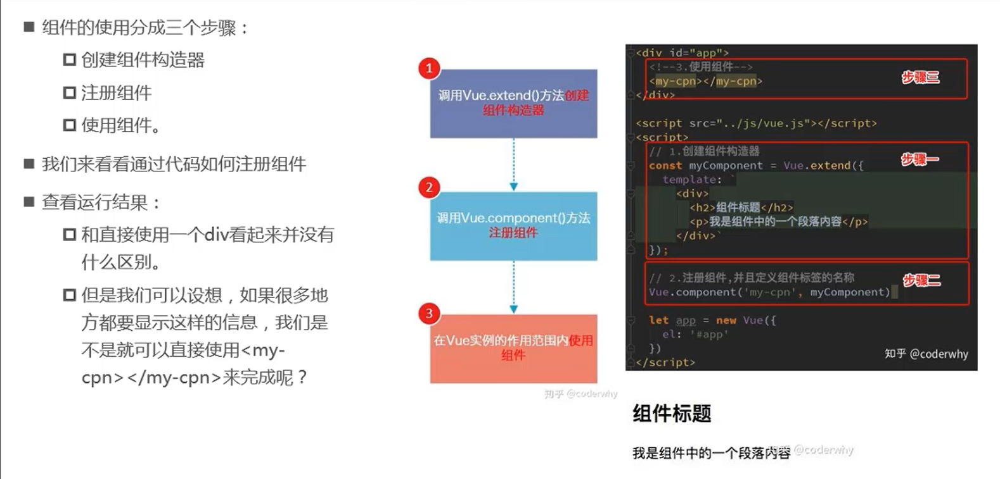
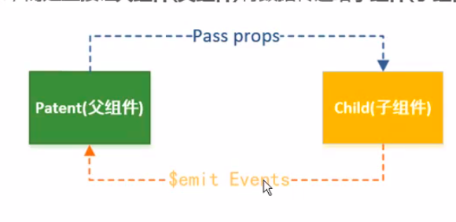

# 组件化

- 什么是组件化



- Vue 组件化思想



- 注册组件的基本步骤



## 组件化的基础使用

语法

```javascript
//创建组件构造器对象
let cpn = Vue.extend({
    template: `
    这里面写html代码
    `
});

//注册组件
Vue.component('要使用的标签名', 组件构造器对象)
```

例： 

```html
<div id="app">
        <my-cpn></my-cpn>
</div>
```

```javascript
const cpn = Vue.extend({
    template: `
        <div>
            <h2>这里是题目</h2>
            <p>这里是内容1</p>
            <p>这里是内容2</p>
        </div>
    `
});

Vue.component('my-cpn', cpn);

let vue;

vue = new Vue({
    el: "#app"
});
```

注意： 必须要将组件的父元素挂载在Vue上， 而且必须写在组件注册之后

## 全局组件和局部组件

上面写的就是全局组件，可以在多个Vue实例中使用

- 局部组件

写在组件里或vue实例里面的组件就是局部组件，局部组件只能在此Vue实例或此组件中使用

```html
<div id="app">
        <my_cpn></my_cpn>
</div>
```

```javascript
const cpn = Vue.extend({
    template: `
    <div>这里是组件</div>
    `
})

let vue;

vue = new Vue({
    el:"#app",
    components: {
        my_cpn: cpn
    }
})
```

## 注册组件的语法糖

- 全局

```javascript
Vue.component('my-cpn', {
   template:`<div>这里是组件的语法糖</div>`
})
//这里就不用写Vue.extend()了

let vue = new Vue({
    el: "#app"
})
```

- 局部

```javascript
let vue;
vue = new Vue({
    el: "#app",
    components: {
        my_cpn: {
            template:`<div>这里局部组件的语法糖</div>`
        }
    }
})
```

## 组件模板的分离写法

- 1)用 ```script```标签, 然后用id指向

```html
<div id="app">
        <my_cpn></my_cpn>
</div>
<script type="text/x-template" id="fCpn">
        <div>
            <h2>这里是标题</h2>
            <p>这里是段落</p>
        </div>
</script>
```

```javascript
let vue;
vue = new Vue({
    el: '#app',
    components: {
        my_cpn: {
            template: `#fCpn`
        }
    }
})
```

- 2) 使用 template标签,用id指向

js代码和上面的一样

```html
<div id="app">
        <my_cpn></my_cpn>
</div>
<template id="fCpn">
    <div>
        <h2>这是标题</h2>
        <p>这里是段落</p>
    </div>
</template>
```

## 父子组件

```html
<div id="app">
        <parent></parent>
    </div>
<template id="parent">
    <div>
        <h2>这是父组件的标题</h2>
        <p>这里父组件的段落</p>
        <child></child>
    </div>
</template>
<template id="child">
    <div>
        <p>这是子组件的段落</p>
        <h2>这是题目</h2>
    </div>
</template>
```

```javascript
Vue.component('parent', {
    template: `#parent`,
    components: {
        //这里就是子组件了
        child: {
            template: `#child`
        }
    }
})

let vue;
vue = new Vue({
    el: '#app',
})
```

注意：

```template``` 标签里面只能放一个根元素

不能写成

```html
<template>
    <h2>111</h2>
    <p>222</p>
</template>
```

我们用一个div将他们包起来即可

```html
<template>
<div>
   <h2>111</h2>
    <p>222</p>
</div>
</template>
```

## 组件数据的存放

Vue是不能直接访问Vue实例中的data中的数据的

所以组件也需要有自己的 ```data``` 属性和 ```template``` 并列, 组件还可以有 ```methods```并列

不同的是组件的data属性必须是函数，而且要返回一个对象

```html
<div id="app">
        <my_cpn></my_cpn>
</div>
<template id="cpn">
        <div>
            <h2>{{fName}}</h2>
            <p>{{number}}</p>
        </div>
</template>
```

```javascript
let vue;
vue = new Vue({
    el: '#app',
    components:{
        my_cpn: {
            template: `#cpn`,
            data() {
                return {
                    fName: 'zzz',
                    number: 666
                }
            }
        }
    }
})
```

那么为什么 组件中的data必须是一个函数呢？

因为一个组件可能用多次，那么不同的组件必须是独立的，他们不能共用一个数据

例如： 我们写个计数器组件

```html
<div id="app">
        <my_cpn></my_cpn>
        <my_cpn></my_cpn>
        <my_cpn></my_cpn>
        <my_cpn></my_cpn>
    </div>
    <template id="counter">
        <div>
            <h3>当前数字为：{{num}}</h3>
            <button @click="inc">+</button>
            <button @click="dec">-</button>
        </div>
    </template>
```

```javascript
let vue;
vue = new Vue({
    el: '#app',
    components: {
        my_cpn: {
            template: `#counter`,
            data() {
                return {
                    num: 0
                }
            },
            methods: {
                inc() {
                    this.num++;
                },
                dec()  {
                    this.num--;
                }
            }
        }
    }
})
```

但是如果组件中data可以写成一个对象，那么之间将相互影响，例如下面的代码

html代码和上面的代码一样

```javascript
let obj = {
    num: 0
}

let vue;
vue = new Vue({
    el: '#app',
    components: {
        my_cpn: {
            template: `#counter`,
            data() {
                return obj
            },
            methods: {
                inc() {
                    this.num++;
                },
                dec()  {
                    this.num--;
                }
            }
        }
    }
})
```

## 父子组件的通信

我们已经介绍了组件是不能引用父组件或者是Vue实例的数据的

但是在开发中，往往一些数据确实需要从上层传递到下层(我们一般都是父组件发送网络请求获取数据，然后传递给

> 如何进行父子组件的通信呢？

- 通过 ```props``` 向子组件传递数据
- 通过事件向父组件发送消息



- 父传子

### props 的基本用法

父组件向子组件传递数据

在子组件中添加 ```prop``` 属性，

- prop可以是一个数组，数组里面放着形参，而在html中我们就将父组件中的数据传入

```html
<div class="" id="app">
        <my_cpn v-bind:child="number"></my_cpn>
</div>
    <template id="cpn">
        <div>
            <h2>{{child}}</h2>
        </div>
    </template>
```

```javascript
const vue = new Vue({
    el:'#app',
    data: {
        number: 666
    },
    components: {
        my_cpn: {
            template: `#cpn`,
            props: ['child']
        }
    }
});
```

- 对象写法可以限制数据类型和默认值

```js
const vue = new Vue({
    el:'#app',
    data: {
        number: 666
    },
    components: {
        my_cpn: {
            template: `#cpn`,
            props: {
                child: Number
            }
        }
    }
});
```

传入默认值，当没有传入或者父组件中没有时，显示默认值

```js
const vue = new Vue({
    el:'#app',
    data: {
        number: 666
    },
    components: {
        my_cpn: {
            template: `#cpn`,
            props: {
                child: {
                    type: {String, Number},//类型 这里也可以写多种类型
                    default: '333',//默认值
                    require: true,
                }
            }
        }
    }
});
```

里面的require属性，当里面的值时 ```true``` 时,那么这个值时必须传入的，否则会报错

如果 type 为对象或者数组时，那么默认值必须是一个函数

这里的类型也可以是自定义的类型


```javascript
function Person() {
    this.name = 'zzz';
    this.age = 18;
}

const vue = new Vue({
    el: '#app',
    data: {

    },
    components: {
        my_cpn: {
            template: `#cpn`,
            props: {
                child: Person 
            }
        }
    }
})
```

### props 驼峰标识

```html
<div class="" id="app">
    <my_cpn v-bind:user-info="info"></my_cpn>
    <!--这里里面的userInfo要写成user-info, 否则会报错-->
</div>
<template id="cpn">
    <div>
        <h2>{{userInfo}}</h2>
    </div>
</template>
```

```javascript
const vue = new Vue({
    el: '#app',
    data: {
        info: {
            userName: 'ml',
            age: 18,
            height: 1.50
        }
    },
    components: {
        my_cpn: {
            template: `#cpn`,
            props: {
                userInfo:{
                    type: Object,
                    default() {return {woc: 666}}
                }
            }
        }
    }
})
```

- 子传父

通过 ```$emit``` 自定义事件将数据给父组件 (emit是发射的意思)

语法

```javascript
this.$emit('自定义事件的名字',传递的参数)
```

例子：

```html
    <div id="app">
        <my_cpn @get-item="text"></my_cpn>
        <!--这里不用传item，他会自动将item传入-->
    </div>
    <template id="buttons">
        <div>
            <button v-for="item in categories"
                    @click="btnClick(item)">
                {{item.shopName}}</button>
        </div>
    </template>
```

```javascript
let vue;
vue = new Vue({
    el:'#app',
    components: {
        my_cpn: {
            template: `#buttons`,
            data() {
                return {
                    categories: [
                            {id: 1, shopName: '家用电器'},
                            {id: 2, shopName: '学习用品'},
                            {id: 3, shopName: '数码相机'},
                            {id: 4, shopName: '美丽花卉'},
                    ]
                }

            },
            methods: {
                btnClick(item) {
                    this.$emit('get-item',item);
                //    这里不能用驼峰，会报错
                }
            }
        }
    },
    methods: {
      text(item) {
          console.log(item);
      }
    }
})
```

这里补充一个小知识： 组件也可以使用单标签

注意： 双向绑定不要绑定到props上，因为他会覆盖父组件里面的值

下面的代码可以执行，但是会报错

```html
<div id="app">
    <my_cpn :number1="num1" :number2="num2"></my_cpn>
</div>
<template id="example">
    <div>
        <label>
            <input type="text" v-model="number1">
        </label>
        <h2>{{number1}}</h2>
        <label>
            <input type="text" v-model="number2">
        </label>
        <h2>{{number2}}</h2>
    </div>
</template>
```

```javascript
let vue;

vue = new Vue({
    el: '#app',
    data: {
        num1: 0,
        num2: 1
    },
    components: {
        my_cpn: {
            template: `#example`,
            props: {
                number1: Number,
                number2: Number
            }
        }
    }
})
```

下面就解决这个问题

父子组件结合双向绑定的例子：

```html
<div id="app">

        <my_cpn :number1="num1"
                :number2="num2"
                @change-number1="changeNum1"
                @change-number2="changeNum2">
        </my_cpn>
</div>
<template id="example">
        <div>
            <h2>父： {{number1}}</h2>
            <h2>子： {{cNum1}}</h2>
            <label>
                <input type="number" :value="cNum1" @input="changeNum1">
            </label>
            <h2>父： {{number2}}</h2>
            <h2>子： {{cNum2}}</h2>
            <label>
                <input type="number" :value="cNum2" @input="changeNum2">
            </label>
        </div>
</template>
```

```javascript
let vue;

vue = new Vue({
    el: '#app',
    data: {
        num1: 0,
        num2: 1
    },
    methods: {
        changeNum1(number1) {
            this.num1 = parseFloat(number1);
        },
        changeNum2(number2) {
            this.num2 = parseFloat(number2);
        }
    },
    components: {
        my_cpn: {
            template: `#example`,
            props: {
                number1: Number,
                number2: Number
            },
            data() {
                return {
                    cNum1: this.number1,
                    cNum2: this.number2
                }
            },
            methods: {
                changeNum1(event) {
                    this.cNum1 = event.target.value;
                    this.$emit('change-number1', this.cNum1);
                    this.cNum2 = this.cNum1 * 100;
                    this.$emit('change-number2', this.cNum2);
                },
                changeNum2(event) {
                    this.cNum2 = event.target.value;
                    this.$emit('change-number2', this.cNum2);
                    this.cNum1 = this.cNum2 / 100;
                    this.$emit('change-number1', this.cNum1);
                }
            }
        }
    }
})
```

### 通过watch改进上面的代码

watch能够监听属性值的改变，并调用相应的函数

```html
<div id="app">
        <my_cpn :number1="num1"
                :number2="num2"
                @change-number1="changeNum1"
                @change-number2="changeNum2">
        </my_cpn>
</div>
<template id="example">
        <div>
            <h2>父： {{number1}}</h2>
            <h2>子： {{cNum1}}</h2>
            <label>
                <input type="number" v-model="cNum1">
            </label>
            <h2>父： {{number2}}</h2>
            <h2>子： {{cNum2}}</h2>
            <label>
                <input type="number" v-model="cNum2">
            </label>
        </div>
</template>
```

```javascript
let vue;

vue = new Vue({
    el: '#app',
    data: {
        num1: 0,
        num2: 1
    },
    methods: {
        changeNum1(number1) {
            this.num1 = parseFloat(number1);
        },
        changeNum2(number2) {
            this.num2 = parseFloat(number2);
        }
    },
    components: {
        my_cpn: {
            template: `#example`,
            props: {
                number1: Number,
                number2: Number
            },
            data() {
                return {
                    cNum1: this.number1,
                    cNum2: this.number2
                }
            },
            watch: {
                cNum1(newNumber, oldNumber) {
                    this.cNum1 = newNumber;
                    this.$emit('change-number1', this.cNum1);
                    this.cNum2 = this.cNum1 * 100;
                    this.$emit('change-number2', this.cNum2);
                },
                cNum2(newNumber, oldNumber) {
                    this.cNum2 = newNumber;
                    this.$emit('change-number2', this.cNum2);
                    this.cNum1 = this.cNum2 / 100;
                    this.$emit('change-number1', this.cNum1);
                }
            }
        }
    }
})
```

### 父子组件的访问方式

- 父组件通过 ```$children``` 或者 ```$refs``` 访问子组件
- 子组件通过 ```$parent``` 访问子组件


