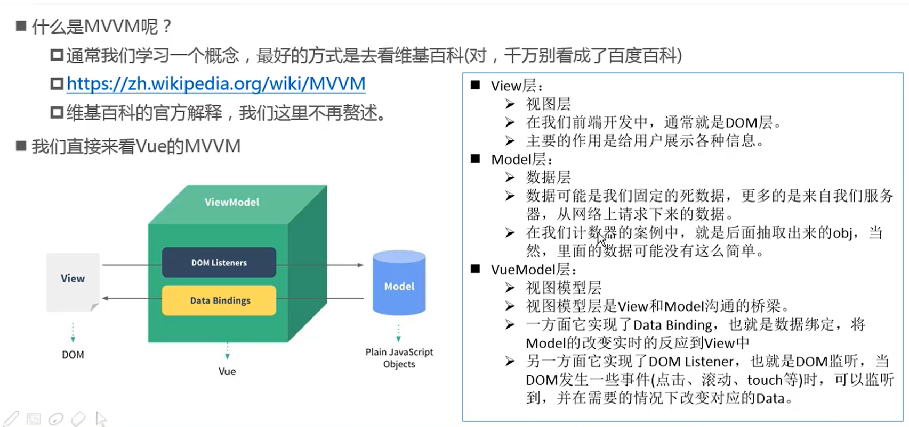

# Vue

## Vue 初体验

```html
<div id="app">{{name}}</div>
<!-- 在浏览器中就会显示Hello Vue -->
```

```js
const app = new Vue({
  //声明式编程
  el: '#app', //用于挂载要管理的元素
  data: {
    name: 'Hello Vue'//定义数据
  }
})
```

可以通过修改 app._data.name 来修改data里面的name值

列表

```html
<div id="app">
    <ul>
      <li v-for="item in numbers">{{item}}</li>
    </ul>
  </div>
```

```js
const app = new Vue({
  //声明式编程
  el: '#app', //用于挂载要管理的元素
  data: {
    numbers: ['1', '2', '3', '4'],
  }
})
```

v-for也可以获得里面的索引值

```html
<h2 v-for="(item, index) in lists"></h2>
```

```html
<div id="app">
    <p>当前的数字为:{{counter}}</p>
    <button @click="inc">+</button>
    <button @click="sub">-</button>
</div>
```

```js
const app = new Vue({
  el: '#app',
  data: {
    counter: 0
  },
  methods: {
    inc () {
      this.counter++;
      console.log('数字增长');
    },
    sub () {
      this.counter--;
      console.log('数字减小');
    }
  }
});
```

注意： ```@click='sub'``` 和 ```v-on:click='sub'``` ```@clilck``` 是 ```v-on:click``` 的语法糖

## Vue 中的mvvm原理

MVVM： Model View ViewModel



## Vue 的生命周期


## 插值的操作

### Mustache语法

双大括号的语法就是 Mustache(英文：胡须) 语法

mustache是不能写在属性里面的即 不能      ```
    <h2>{{name}}</h2>
    <h2 v-once>{{name}}</h2>
</div>
<!-- 上面的是111，下面展示的是 我是一个名字 -->
```

```javascript
const app = new Vue({
  el: '#app',
  data: {
    name: '我是一个名字'
  }
});

app.name = '111';
```

h2\[v-once\]展示的永远是最初显示的那个值

### v-html 指令

v-html能够将字符串解析成html

```html
<div id="app">
    <h2 v-html="url"></h2>
</div>
```

```javascript
const app = new Vue({
  el: '#app',
  data: {
    url: `<a href='https://www.baidu.com'>百度一下</a>`
  }
});
```

### v-text

v-text 和 {{}} 相同，但是v-text会覆盖原来的文本

```html
<div id="app">
    <h2 v-text='name'>这里的文本会被替换掉</h2>
</div>
```

```js
const app = new Vue({
  el: '#app',
  data: {
    name: 'ddd'
  }
});
```

### v-pre

和pre标签一样

### v-cloak

cloak是斗篷的意思，为了防止网络较慢时，将{{name}}解析出来，我们用v-cloak

当vue执行完毕后，会自动将v-cloak删除掉

```html
<div id="app" v-cloak>
    <h2>{{name}}</h2>
</div>
```

```javascript
setTimeout(() => {
  const app = new Vue({
    el: '#app',
    data: {
      name: 'ddd'
    }
  });
},2000)
```

```css
[v-cloak] {
    display: none;
}
```

## v-bind 动态绑定属性

```html
<div id="app">
      
</div>
```

```javascript
const app = new Vue({
  el: '#app',
  data: {
    imgSrc: 'https://cn.vuejs.org/images/logo.png'
  }
})
```

添加了 ```v-bind``` 后，src后面的值就是一个变量了

我们也可以写成

```html
<div id="app">
      
</div>
```

```v-bind:``` 的语法糖 ```:```

### v-bind动态绑定```class```类名


#### 用对象的方式


语法：

```html
<div v-bind:class="{类名1 : Boolean, 类名2 : Boolean ………… }"></div>
```

当后面的值为true的时候，类名就会被添加到class里面，否则不会

```html
<div id="app">
      <h2 :class="{active: isActive, line: isLine}">这里是内容</h2>
<!--这里就会看到黑底白字-->
</div>
```

```javascript
const app = new Vue({
  el: '#app',
  data: {
    isActive: true,
    isLine : true
  }
})
```

```css
.active {
    color: #fff;
}

.line {
    background-color: #000;
}
```

注意： ```v-bind:class``` 和 ```class``` 可以同时存在，他们不会覆盖，最后是两个内容的合并


小案例: 点击按钮文字颜色的切换

```html
<div id="app">
      <h2 :class="{active: isActive}">这里是内容</h2>
      <button @click="changeActive">变色</button>
</div>
```

```javascript
const app = new Vue({
  el: '#app',
  data: {
    isActive: true
  },
  methods: {
    changeActive () {
      this.isActive = !this.isActive;
    }
  }
})
```

```css
.active {
    color: #f40;
}
```

#### 用数组的方式

```html
<div id="app">
      <h2 :class="[varClass1, varClass2]">这里是内容</h2>
  </div>
```

```javascript
const app = new Vue({
  el: '#app',
  data: {
    varClass1 : 'active',
    varClass2 : 'line'
  }
})
```

作业：点击列表，使得点击的变红，未点击的变黑

```html
<div id="app">
      <ul>
          <li v-bind:class="{active: isActive[index]}" v-for="(number, index) in numbers" @click="changeColor(index)">{{number}}</li>
      </ul>
</div>
```

```css
.active {
    color: #f40;
}
```

```javascript
const app = new Vue({
  el: '#app',
  data: {
    numbers : [111, 222, 333, 444, 555],
    isActive: [1,0,0,0,0]
  },
  methods: {
    changeColor(index) {
      this.isActive = [0,0,0,0,0];
      this.isActive[index] = 1;
    }
  }
})
```

### v-bind动态绑定style

- 对象语法
- 数组语法

#### 对象语法

语法;

```html
<h2 :style="{css属性名： css属性值，………………}"></h2>
```

```html
<div id="app">
      <h2 :style="{fontSize: `${fontSize}px`}">这里是内容</h2>
</div>
```

```javascript
const app = new Vue({
  el: '#app',
  data: {
    fontSize: 50
  }
})
```

#### 数组语法

```html
<div id="app">
      <h2 :style="[{fontSize: '50px'}, {color: 'red'}]">这里是内容</h2>
</div>
```


